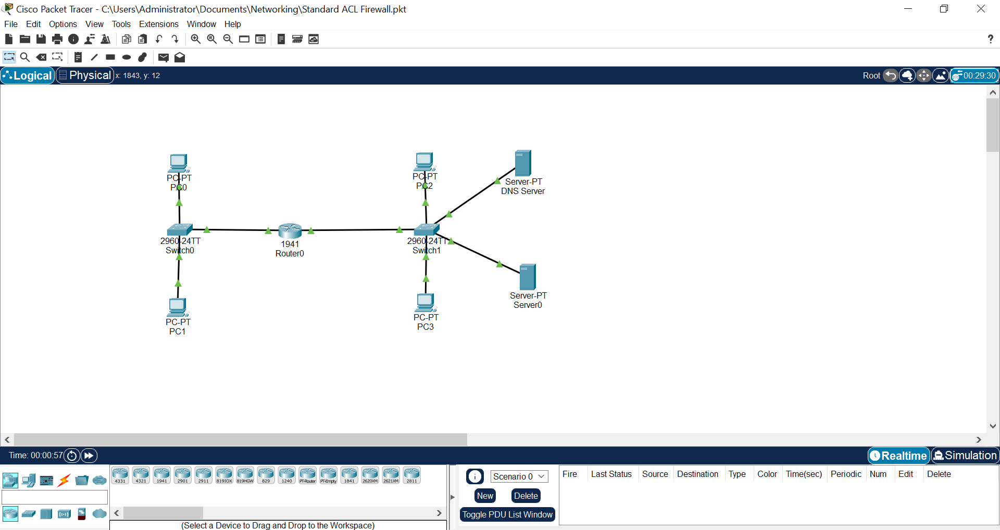
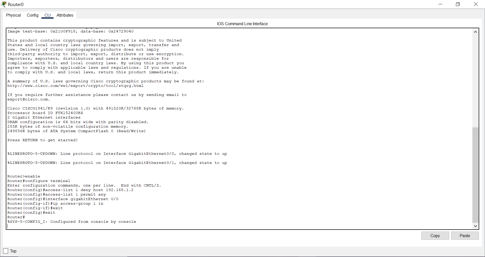
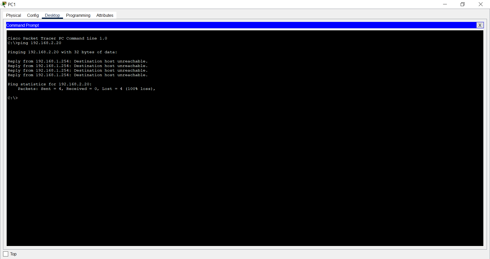
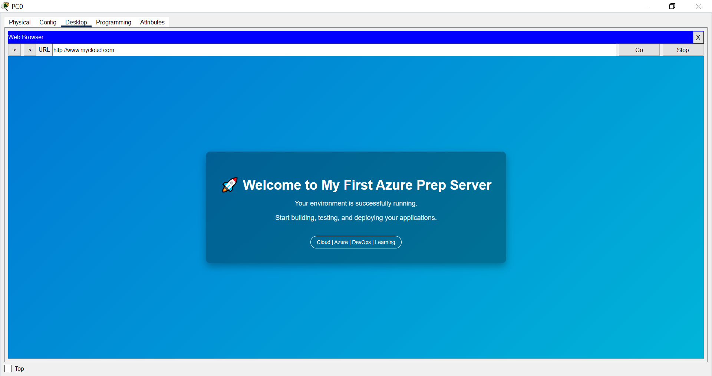

# Lab 3: Access Control List (ACL) Traffic Filtering

## Objective

This lab demonstrates how a router can enforce basic network security policies using a Standard Access Control List (ACL).

The configuration restricts access to network resources based on the source IP address.

### Scenario

Two hosts exist in Subnet A:

- **PC-0 (Boss)** → Allowed to access the web server
- **PC-1 (Intern)** → Blocked from accessing the web server

The router enforces this policy using a Standard ACL.

---

## Network Topology

The following topology was implemented in Cisco Packet Tracer to simulate routed communication and access control.



---

## Network Configuration

### Subnet A (Client Network)

| Device | IP Address | Role |
|------|------|------|
| PC-0 | 192.168.1.1 | Allowed host |
| PC-1 | 192.168.1.2 | Blocked host |
| Router Interface | 192.168.1.254 | Default Gateway |

Subnet Mask: `255.255.255.0 (/24)`

---

### Subnet B (Service Network)

| Device | IP Address | Role |
|------|------|------|
| Web Server | 192.168.2.10 | HTTP Service |
| DNS Server | 192.168.2.20 | Domain Name Resolution |
| Router Interface | 192.168.2.254 | Gateway |

Subnet Mask: `255.255.255.0 (/24)`

---

## Router ACL Configuration

A Standard Access Control List was created to block the Intern PC while allowing all other hosts.

### Router CLI Configuration

```bash
enable
configure terminal

access-list 1 deny host 192.168.1.2
access-list 1 permit any

interface gigabitEthernet 0/0
ip access-group 1 in

exit
exit
```

---

## Configuration Explanation

| Command | Purpose |
|------|------|
| access-list 1 deny host 192.168.1.2 | Blocks the Intern PC |
| access-list 1 permit any | Allows all other traffic |
| ip access-group 1 in | Applies the ACL to incoming traffic |

---

## Router Configuration Screenshot



---

## Validation Tests

### 1. Blocked Host Test

The Intern PC attempted to ping the DNS server.



Result:

```
Destination host unreachable
```

This confirms that the ACL successfully blocks traffic from the Intern PC.

---

### 2. Allowed Host Test

The Boss PC accessed the web server using the DNS domain name.



Result:

The web page loaded successfully, proving that allowed hosts can still access network services.

---

## Key Concepts Demonstrated

- Standard Access Control Lists
- Source IP based traffic filtering
- Router interface ACL application
- Network security policy enforcement
- DNS resolution and HTTP service access

---

## Learning Outcome

This lab demonstrates how routers can enforce basic network security policies by controlling which hosts are allowed or denied access to services across routed networks.

---

## Lab Summary

| Feature | Implemented |
|------|------|
| Routed network connectivity | Yes |
| DNS resolution | Yes |
| HTTP web service access | Yes |
| ACL security policy enforcement | Yes |