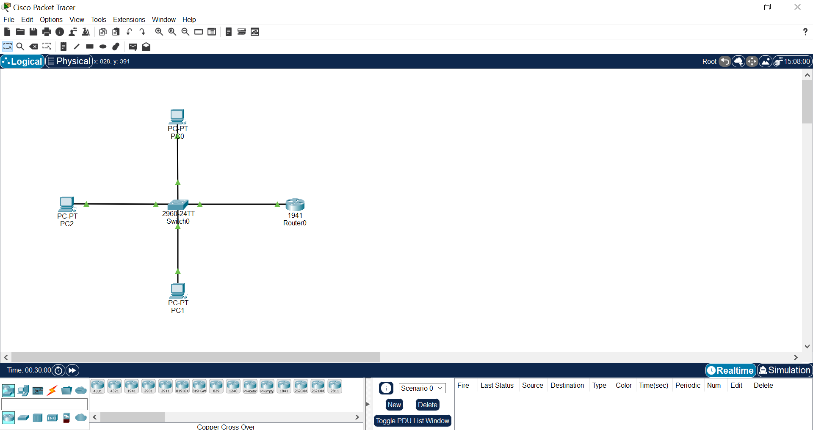
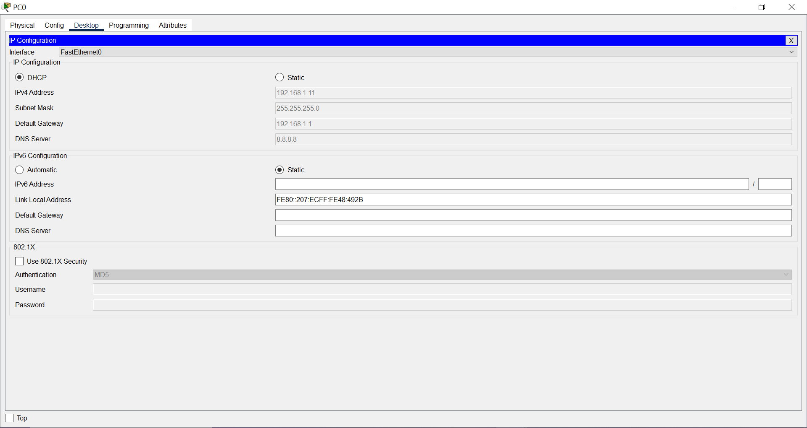
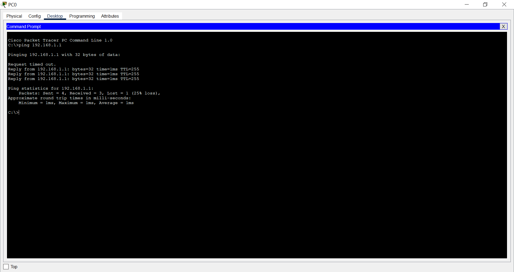

# Lab 4: DHCP Dynamic IP Assignment

## Objective

This lab demonstrates how a router can function as a **DHCP (Dynamic Host Configuration Protocol) server** to automatically assign IP addresses and network configuration to client devices.

The goal is to eliminate manual IP configuration and enable dynamic network provisioning.

---

## Network Topology

The following topology was implemented in Cisco Packet Tracer to simulate DHCP-based IP allocation.



---

## Network Configuration

### Subnet

| Network | Subnet Mask |
|--------|------------|
| 192.168.1.0 | 255.255.255.0 (/24) |

---

### Router (DHCP Server)

| Parameter | Value |
|----------|------|
| Interface IP | 192.168.1.1 |
| Role | Default Gateway + DHCP Server |

---

### DHCP Configuration

The router was configured to dynamically assign IP addresses to clients.

### Router CLI Configuration

```bash
enable
configure terminal

ip dhcp excluded-address 192.168.1.1 192.168.1.10

ip dhcp pool MY_NETWORK
network 192.168.1.0 255.255.255.0
default-router 192.168.1.1
dns-server 8.8.8.8

interface gigabitEthernet 0/0
ip address 192.168.1.1 255.255.255.0
no shutdown

exit
exit
```

---

## Configuration Explanation

| Command | Purpose |
|--------|--------|
| ip dhcp excluded-address | Reserves IP range (not assigned to clients) |
| ip dhcp pool | Creates DHCP pool |
| network | Defines subnet for allocation |
| default-router | Assigns gateway to clients |
| dns-server | Assigns DNS server |
| interface config | Enables router interface |

---

## Validation Tests

### 1. IP Address Assignment

Client devices were configured to obtain IP addresses dynamically.



Result:

- IP address assigned automatically
- Subnet mask assigned
- Default gateway assigned
- DNS server assigned

---

### 2. Connectivity Test

Clients successfully communicated with the router.



Result:

```
Ping successful
```

---

## Key Concepts Demonstrated

- Dynamic Host Configuration Protocol (DHCP)
- Automatic IP address allocation
- DHCP pool configuration
- Default gateway and DNS assignment
- Network automation fundamentals

---

## Learning Outcome

This lab demonstrates how DHCP simplifies network management by automating IP address assignment and reducing manual configuration effort.

It highlights the importance of dynamic configuration in modern network and cloud environments.

---

## Lab Summary

| Feature | Implemented |
|--------|------------|
| DHCP server configuration | Yes |
| Automatic IP assignment | Yes |
| Gateway configuration | Yes |
| DNS assignment | Yes |
| Connectivity validation | Yes |