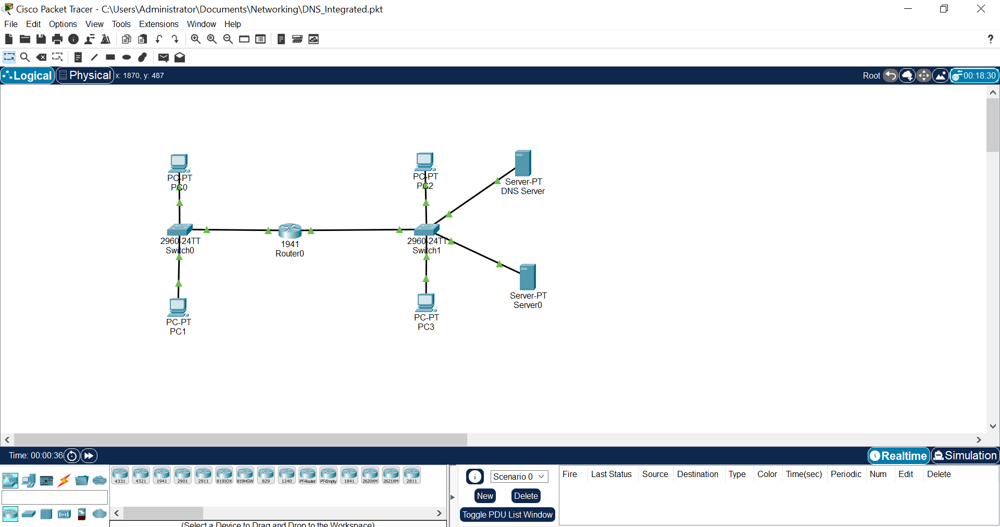
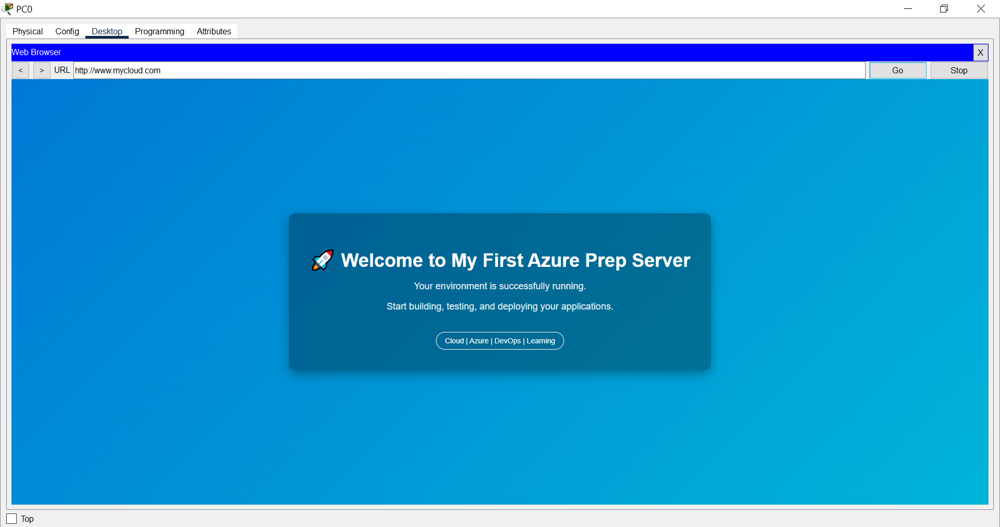

# DNS and Web Service Simulation

## Objective

The objective of this lab is to simulate how users access a web service using a domain name instead of a numerical IP address.

This experiment demonstrates how DNS resolution works in combination with routing and HTTP services.

---

## Network Architecture

A DNS server and an HTTP web server were configured within the network environment.

The DNS server was responsible for resolving a domain name to the IP address of the web server.

Client devices were configured to use the DNS server for name resolution.

### Network Topology

---

## Configuration

### DNS Configuration

The DNS server was configured with a resource record mapping the domain name to the web server's IP address.

| Resource Record | Name | Type | Address (Target) |
| :--- | :--- | :--- | :--- |
| A-Record | www.mycloud.com | Host | 192.168.2.10 |

---

### Client Configuration

PC0 was configured to use the DNS server as its static DNS resolver:

DNS Server: **192.168.2.20**

This directs all domain name queries from the client device to the DNS server.

---

## Key Concepts Demonstrated

- DNS name resolution
- Domain-to-IP mapping
- HTTP web service hosting
- Interaction between DNS and application services
- Protocol encapsulation across network layers

This lab demonstrates how **DNS (UDP Port 53)** enables a client to resolve a domain name before establishing an **HTTP connection (TCP Port 80)** to access the web server.

---

## Validation

The hosted website was successfully accessed through a browser using the configured domain name.

### Browser Result

Successful loading of the webpage confirms that DNS resolution, routing, and HTTP service delivery are functioning correctly.

---

## Outcome

This experiment demonstrates the complete communication flow from domain name resolution to web service access, highlighting the interaction between networking infrastructure and application-layer services.