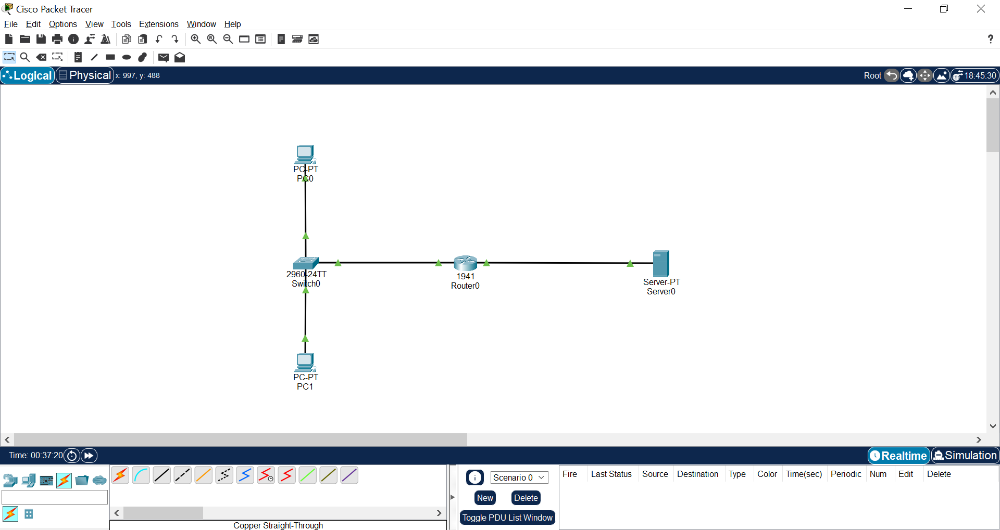
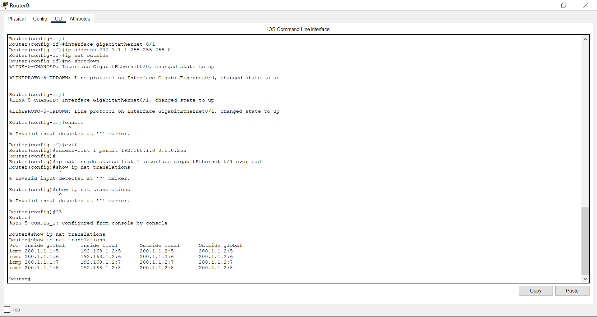

# Lab 5: NAT (Network Address Translation) – Private to Public Communication

## Objective

This lab demonstrates how a router performs **Network Address Translation (NAT)** to enable devices in a private network to communicate with external networks using a public IP address.

The goal is to simulate how private IP addresses are translated into a public IP for external communication.

---

## Network Topology

The following topology was implemented in Cisco Packet Tracer:

- A private network (192.168.1.0/24) with multiple client devices
- A router performing NAT
- A public network hosting a server



---

## Network Configuration

### Private Network

| Device | IP Address | Gateway |
|--------|-----------|---------|
| PC0 | 192.168.1.2 | 192.168.1.1 |
| PC1 | 192.168.1.3 | 192.168.1.1 |

---

### Router Configuration

| Interface | IP Address | Role |
|----------|-----------|------|
| GigabitEthernet0/0 | 192.168.1.1 | NAT Inside |
| GigabitEthernet0/1 | 200.1.1.1 | NAT Outside |

---

### Public Network

| Device | IP Address | Gateway |
|--------|-----------|---------|
| Server | 200.1.1.2 | 200.1.1.1 |

---

## NAT Configuration (PAT)

The router was configured using **Port Address Translation (PAT)** to allow multiple private devices to share a single public IP.

### Router CLI Configuration

```bash
enable
configure terminal

interface gigabitEthernet 0/0
ip address 192.168.1.1 255.255.255.0
ip nat inside
no shutdown

interface gigabitEthernet 0/1
ip address 200.1.1.1 255.255.255.0
ip nat outside
no shutdown

access-list 1 permit 192.168.1.0 0.0.0.255

ip nat inside source list 1 interface gigabitEthernet 0/1 overload

exit
exit
```

---

## Configuration Explanation

| Command | Purpose |
|--------|--------|
| ip nat inside | Marks interface as internal network |
| ip nat outside | Marks interface as external network |
| access-list 1 | Defines which internal IPs can be translated |
| ip nat inside source list | Enables NAT using ACL |
| overload | Enables PAT (many-to-one mapping) |

---

## Validation Tests

### 1. Connectivity Test

Clients in the private network successfully communicated with the public server.


Result:

```
Ping successful from private network to public server
```

---

### 2. NAT Translation Table

The router dynamically translated private IP addresses to the public IP.



Example Entry:

```
Inside Local: 192.168.1.2 → Inside Global: 200.1.1.1
```

---

## Key Concepts Demonstrated

- Network Address Translation (NAT)
- Port Address Translation (PAT)
- Private vs Public IP addressing
- Source IP translation
- Many-to-one IP mapping
- Router-based traffic translation

---

## Learning Outcome

This lab demonstrates how NAT enables private networks to access external networks securely and efficiently using a shared public IP address.

It highlights a fundamental concept used in real-world networking and cloud platforms.

---

## Lab Summary

| Feature | Implemented |
|--------|------------|
| NAT configuration | Yes |
| PAT (overload) | Yes |
| Private to public communication | Yes |
| Translation verification | Yes |
| Connectivity validation | Yes |