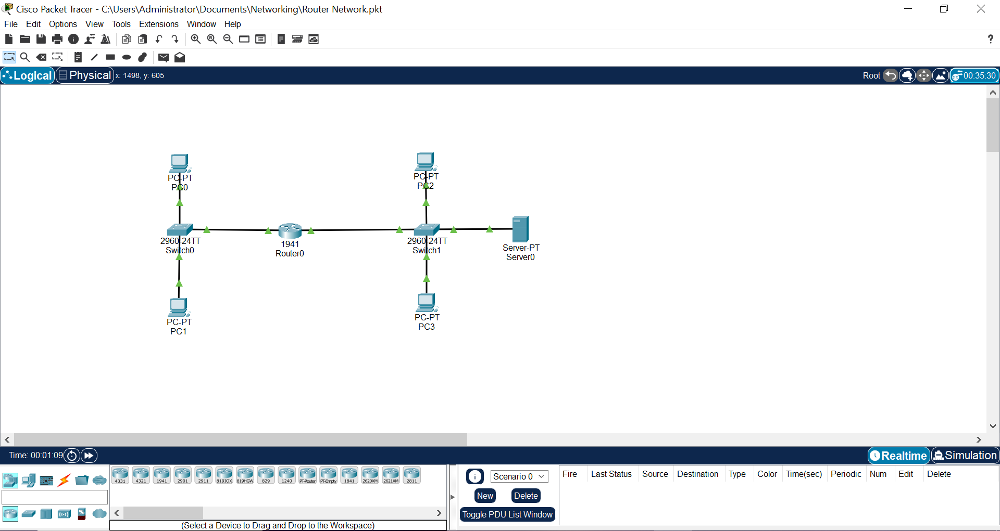
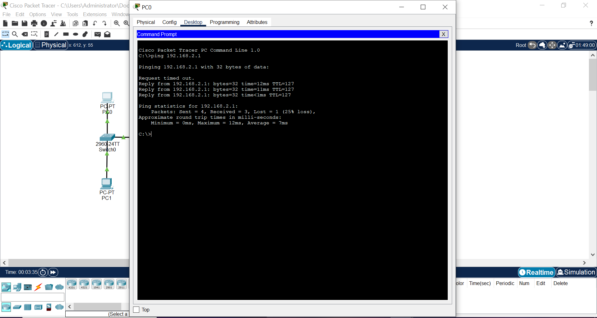

# Routed Network Connectivity

## Objective

The objective of this lab is to understand how devices located in different subnets communicate with each other through a router acting as a gateway.

This experiment demonstrates how routing enables inter-network communication between two isolated local area networks.

---

## Network Architecture

Two separate local area networks were created using switches, each representing a different subnet.  
A router was used to connect these networks and facilitate packet forwarding between them.

### Network Topology

---

## Network Configuration

Two subnets were configured in the network:

Subnet A  
192.168.1.0 /24  
Mask: 255.255.255.0

Subnet B  
192.168.2.0 /24  
Mask: 255.255.255.0

Router gateway interfaces:

- Gateway for Subnet A: **192.168.1.254**
- Gateway for Subnet B: **192.168.2.254**

Each device within a subnet was configured to use the router interface as its default gateway.

---

## Key Concepts Demonstrated

- Default Gateway
- Inter-network routing
- Packet forwarding between subnets
- Communication across network boundaries

---

## Validation

Connectivity between devices in different subnets was verified using ICMP ping.

### Ping Test Result

Note: Initial ICMP packets may drop due to **ARP (Address Resolution Protocol)** discovery while devices learn MAC address mappings. Subsequent ping attempts confirm stable connectivity between the networks.

---

## Outcome

This experiment demonstrates how routing enables communication between isolated networks and highlights the importance of correct gateway configuration and subnet addressing in network communication.