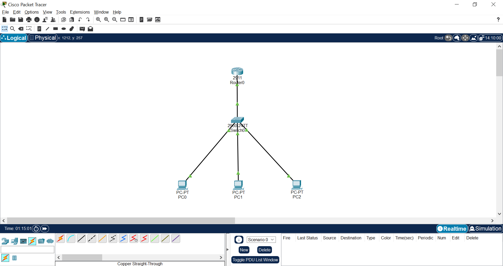
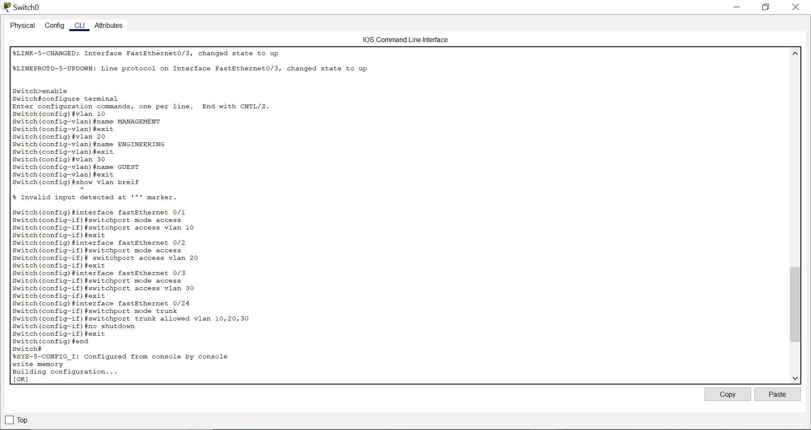
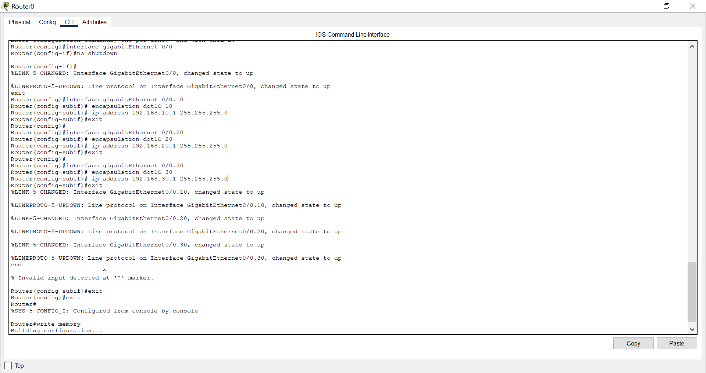
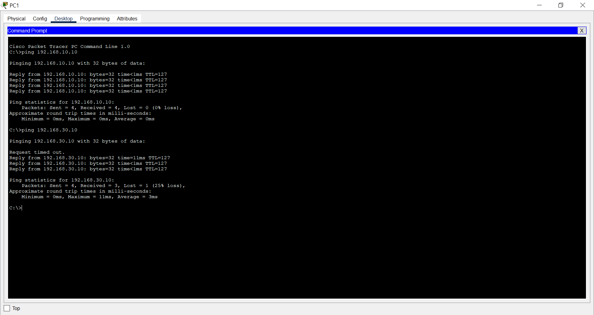

# VLAN Inter-VLAN Routing (Router-on-a-Stick)

## Overview

This lab demonstrates how to enable communication between devices located in different Virtual Local Area Networks (VLANs) using the **Router-on-a-Stick** technique. VLANs logically segment a network into separate broadcast domains, enhancing security and manageability. Since devices in different VLANs cannot communicate directly, a router is configured with subinterfaces to route traffic between them.

---

## Objectives

- Create and configure multiple VLANs on a Layer 2 switch.
- Assign switch ports to specific VLANs.
- Configure a trunk link between the switch and the router.
- Implement inter-VLAN routing using router subinterfaces.
- Verify connectivity between devices in different VLANs.

---

## Network Topology

The topology consists of one router, one Layer 2 switch, and three PCs, each placed in a different VLAN.



---

## VLAN and IP Addressing Scheme

| VLAN ID | VLAN Name   | Subnet            | Default Gateway |
|--------|-------------|-------------------|-----------------|
| 10     | MANAGEMENT  | 192.168.10.0/24   | 192.168.10.1    |
| 20     | ENGINEERING | 192.168.20.0/24   | 192.168.20.1    |
| 30     | GUEST       | 192.168.30.0/24   | 192.168.30.1    |

---

## Step 1: Switch Configuration

VLANs were created on the switch, and access ports were assigned to the respective VLANs. A trunk port was configured to carry traffic for multiple VLANs to the router.

### Switch CLI Configuration

```bash
enable
configure terminal

vlan 10
 name MANAGEMENT
exit

vlan 20
 name ENGINEERING
exit

vlan 30
 name GUEST
exit

interface fastEthernet 0/1
 switchport mode access
 switchport access vlan 10
exit

interface fastEthernet 0/2
 switchport mode access
 switchport access vlan 20
exit

interface fastEthernet 0/3
 switchport mode access
 switchport access vlan 30
exit

interface fastEthernet 0/24
 switchport mode trunk
 switchport trunk allowed vlan 10,20,30
 no shutdown
exit

end
write memory
```

### Verification Commands

```bash
show vlan brief
show interfaces trunk
```



---

## Step 2: Router Configuration (Router-on-a-Stick)

Inter-VLAN routing was implemented using router subinterfaces. Each subinterface corresponds to a VLAN and is configured with IEEE 802.1Q encapsulation.

### Router CLI Configuration

```bash
enable
configure terminal

interface gigabitEthernet 0/0
 no shutdown
exit

interface gigabitEthernet 0/0.10
 encapsulation dot1Q 10
 ip address 192.168.10.1 255.255.255.0
exit

interface gigabitEthernet 0/0.20
 encapsulation dot1Q 20
 ip address 192.168.20.1 255.255.255.0
exit

interface gigabitEthernet 0/0.30
 encapsulation dot1Q 30
 ip address 192.168.30.1 255.255.255.0
exit

end
write memory
```

### Verification Commands

```bash
show ip interface brief
show running-config
```



---

## Step 3: PC Configuration

Each PC was configured with a static IP address and the appropriate default gateway.

| PC  | VLAN | IP Address     | Subnet Mask     | Default Gateway |
|-----|------|----------------|-----------------|-----------------|
| PC0 | 10   | 192.168.10.10  | 255.255.255.0   | 192.168.10.1    |
| PC1 | 20   | 192.168.20.10  | 255.255.255.0   | 192.168.20.1    |
| PC2 | 30   | 192.168.30.10  | 255.255.255.0   | 192.168.30.1    |

---

## Step 4: Connectivity Verification

Connectivity between devices in different VLANs was verified using ICMP ping. Successful replies confirm that inter-VLAN routing is functioning correctly.

### Example Ping Tests

```bash
# From PC0 (VLAN 10)
ping 192.168.20.10
ping 192.168.30.10
```

> **Note:** The first ping request may time out due to ARP resolution. This is normal behavior in networking environments and does not indicate a configuration issue.



---

## Key Concepts Demonstrated

- **VLAN (Virtual Local Area Network):** Logical segmentation of a network into separate broadcast domains.
- **Access Ports:** Switch ports assigned to a single VLAN for end devices.
- **Trunk Ports:** Links that carry traffic for multiple VLANs using IEEE 802.1Q tagging.
- **Router-on-a-Stick:** A method of inter-VLAN routing using router subinterfaces.
- **Default Gateway:** Enables devices to communicate outside their local subnet.
- **Inter-VLAN Routing:** Allows communication between different VLANs.

---

## Relevance to Cloud Computing

The concepts demonstrated in this lab directly map to modern cloud networking services:

| Traditional Networking | Cloud Equivalent |
|------------------------|-----------------|
| VLANs                  | Virtual Network Subnets |
| Router                 | Virtual Network Gateways / Route Tables |
| Inter-VLAN Routing     | Subnet-to-Subnet Communication |
| Access Control         | Network Security Groups (NSGs) |
| Trunking               | Virtual Network Peering |

Understanding these principles provides a strong foundation for designing secure and scalable cloud architectures.

---

## Learning Outcomes

By completing this lab, you have:

- Configured VLANs on a Layer 2 switch.
- Assigned switch ports to appropriate VLANs.
- Implemented trunking using IEEE 802.1Q.
- Configured router subinterfaces for inter-VLAN routing.
- Assigned IP addresses and default gateways to end devices.
- Verified connectivity between VLANs using ICMP.
- Connected traditional networking concepts with cloud networking principles.

---

## Conclusion

This lab successfully demonstrated how communication between multiple VLANs can be achieved using the **Router-on-a-Stick** approach. The implementation reinforces essential networking concepts that are directly applicable to cloud environments, making it a valuable addition to a cloud networking learning portfolio.